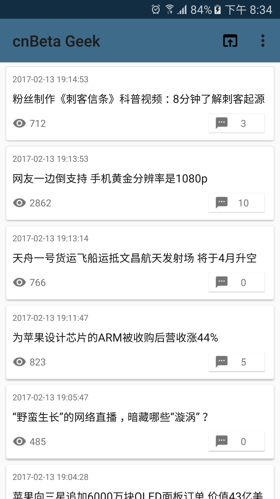
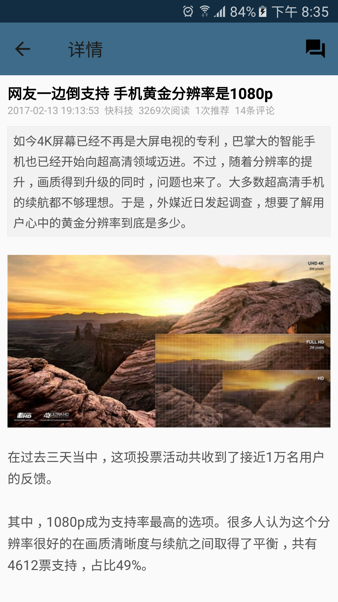
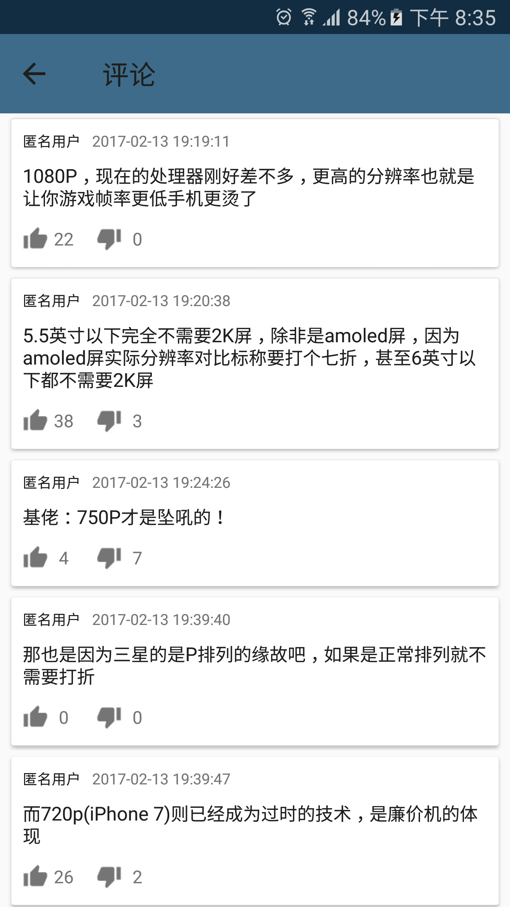

#cnBeta Geek

> 原个人使用的是 ["Cnbeta极客版"](https://play.google.com/store/apps/details?id=io.github.zhea55.CnbetaReader&hl=zh_CN),但是此App上次更新是2015年1月.在评论过多时页面经常崩溃.于是自己就写了这个.**1.0 版本 是向他致敬,故在 ui 或者名称上尽量靠近.**后期会按照个人或者用户的使用做出修改.

# 下载

##国内: **[从酷市场下载](http://www.coolapk.com/apk/com.didikee.cnbetareader)**
##国际:`审核中...`

# 功能列表
- 默认浏览列表
- 文章详情
- 文章评论

# TODO
- 评论楼层显示
- 无图模式

# 截图







# Thanks
**icon resource**: [http://www.easyicon.net/1193375-cnbeta_icon.html](http://www.easyicon.net/1193375-cnbeta_icon.html)

**icon maker**: [https://android-material-icon-generator.bitdroid.de/](https://android-material-icon-generator.bitdroid.de/)

# License

```
   Copyright 2017 didikee

   Licensed under the Apache License, Version 2.0 (the "License");
   you may not use this file except in compliance with the License.
   You may obtain a copy of the License at

     http://www.apache.org/licenses/LICENSE-2.0

   Unless required by applicable law or agreed to in writing, software
   distributed under the License is distributed on an "AS IS" BASIS,
   WITHOUT WARRANTIES OR CONDITIONS OF ANY KIND, either express or implied.
   See the License for the specific language governing permissions and
   limitations under the License.
```